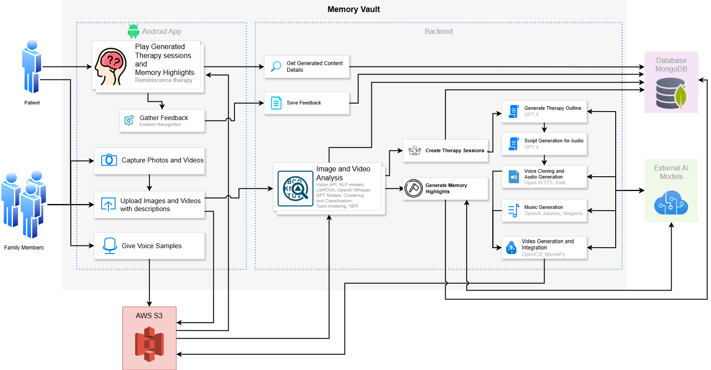

# Memory Vault - An Interactive Reminiscence Therapy Solution for Dementia Patients
## Student Name: W.M.Y. Soysa
## Student ID: IT21244698
---

## Description
Memory Vault is a backend application designed to provide interactive reminiscence therapy for dementia patients. The application helps enhance cognitive abilities and emotional well-being through personalized therapy sessions, memory recall exercises, and emotional support, powered by advanced machine learning and AI technologies.

## Technologies Used:
- **Python**
- **Flask**
- **MongoDB**
- **Transformers**
- **TensorFlow**
- **DeepFace**
- **PyTorch**
- **OpenAI GPT-4**
- **OpenAI TTS**

## Solutions Included:
- **Personalized Therapy Session Generation with Audio Narration**: 
   The system generates personalized therapy sessions for patients, with calming audio narrations using OpenAI's Text-to-Speech (TTS) models (`tts-1` and `tts-1-hd`).
   
- **Memory Analysis and Categorization**: 
   Analyzes the patient's memories and categorizes them based on themes, emotions, and assigns relevant tags for better understanding and session customization.
   
   Models used:
   - **Zero-Shot Classification**: For theme categorization using the model `facebook/bart-large-mnli`.
   - **Emotion Analysis**: 
     - `j-hartmann/emotion-english-distilroberta-base` for emotion recognition.
     - `monologg/bert-base-cased-goemotions-original` for additional emotion analysis.
   - **Tag Extraction**: 
     - SpaCy's `en_core_web_sm` model for extracting relevant tags from memory descriptions.

- **Emotion Analysis During Therapy Sessions**: 
   Real-time emotion analysis of the patient during a therapy session using facial expression recognition with **DeepFace**. The model used for emotion detection in DeepFace is the `VGG-Face` model.

---

## System Overview Diagram



---

## Prerequisites

Before running the Flask server, ensure you have the following installed:

- Python 3.x
- `pip` package manager
- A virtual environment tool (`venv`)

---

## Steps to Run the Flask Server

1. **Clone the Repository:**
   ```bash
   git clone https://github.com/24-25J-194-research-project/memory-vault-backend.git
   cd memory-vault-backend

2. **Create a Virtual Environment:**
   ```bash
   python -m venv venv
   
3. **Activate the Virtual Environment:**
    - **Windows:**
      ```bash
      venv\Scripts\activate
    - **macOS/Linux:**
      ```bash
      source venv/bin/activate
      
4. **Install Required Packages:**

   Once the virtual environment is activated, install the necessary packages listed in `requirements.txt`.
    ```bash
    pip install -r requirements.txt
   
5. **Set Up the Environment Variables:**

   Create a `.env` file in the root directory and add the following environment variables:
   ```bash
   PORT=5000 
   PROFILE=LOCAL
   MONGO_URI=mongodb://localhost:27017 
   DATABASE_NAME=MEMORY_VAULT
   OPENAI_API_KEY_NEW=your_openai_api_key
   ```
   **Note:** Replace `your_openai_api_key` with your OpenAI API key.

6. **Run the Flask Server:**
   ```bash
   python main.py
   ```
   The server should now be running on `http://localhost:5000`.
   
